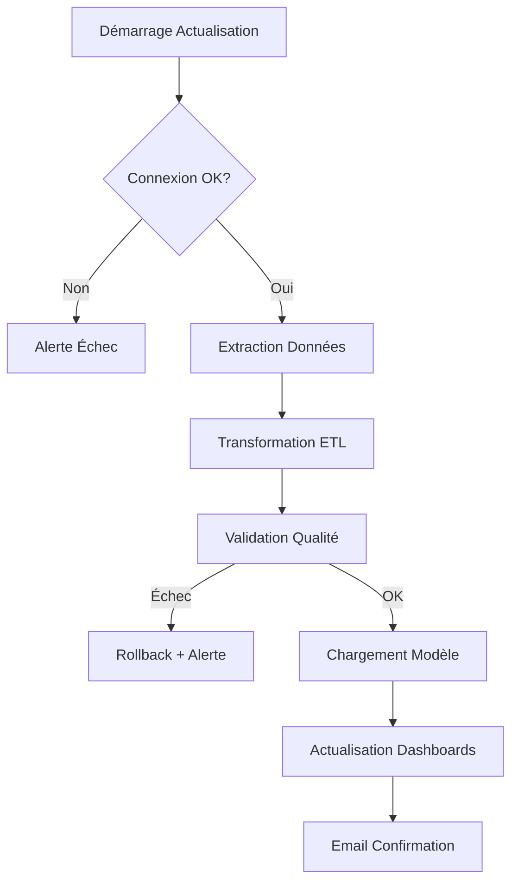

# 🗄️ Schéma des Sources de Données

## Vue d'Ensemble

Ce document décrit l'ensemble des sources de données utilisées pour alimenter les dashboards Power BI de l'EMSI.

---

## 1. Architecture des Sources

```
┌─────────────────────────────────────────────────────────┐
│                    SOURCES DE DONNÉES                    │
├─────────────────────────────────────────────────────────┤
│                                                          │
│  ┌──────────────┐  ┌──────────────┐  ┌──────────────┐ │
│  │   Système    │  │   Système    │  │   Système    │ │
│  │  Académique  │  │  Financier   │  │     RH       │ │
│  │  (SQL Server)│  │   (Excel)    │  │  (Access)    │ │
│  └──────┬───────┘  └──────┬───────┘  └──────┬───────┘ │
│         │                  │                  │         │
└─────────┼──────────────────┼──────────────────┼─────────┘
          │                  │                  │
          └──────────────────┼──────────────────┘
                             ▼
                    ┌─────────────────┐
                    │  Power Query    │
                    │  (ETL Layer)    │
                    └────────┬────────┘
                             ▼
                    ┌─────────────────┐
                    │  Modèle Power   │
                    │  BI (Étoile)    │
                    └────────┬────────┘
                             ▼
                    ┌─────────────────┐
                    │   Dashboards    │
                    └─────────────────┘
```

---

## 2. Sources de Données Détaillées

### 2.1 Système Académique (SQL Server)

**📍 Type** : Base de données SQL Server 2019  
**📍 Serveur** : `EMSI-SQL-PROD\ACADEMIQUE`  
**📍 Base** : `EMSI_Scolarite`  
**📍 Authentification** : Windows Authentication  
**📍 Actualisation** : Quotidienne (6h00)

#### Tables Utilisées

| Table | Description | Lignes (approx.) | Clé Primaire |
|-------|-------------|------------------|--------------|
| `Etudiants` | Informations étudiants | ~8,000 | `ID_Etudiant` |
| `Inscriptions` | Inscriptions par année | ~25,000 | `ID_Inscription` |
| `Filieres` | Liste des filières | ~15 | `ID_Filiere` |
| `Niveaux` | Niveaux d'études | ~5 | `ID_Niveau` |
| `Absences_Etudiants` | Absences étudiants | ~50,000 | `ID_Absence` |
| `Resultats` | Notes et résultats | ~120,000 | `ID_Resultat` |
| `Matieres` | Matières enseignées | ~200 | `ID_Matiere` |

#### Colonnes Clés

**Table Etudiants**
```sql
ID_Etudiant (INT)           -- Identifiant unique
Code_Massar (VARCHAR)       -- Code national
Nom (VARCHAR)
Prenom (VARCHAR)
Date_Naissance (DATE)
Sexe (CHAR)
Ville (VARCHAR)
Telephone (VARCHAR)
Email (VARCHAR)
Date_Premiere_Inscription (DATE)
Statut (VARCHAR)            -- Actif, Diplômé, Abandon
```

**Table Inscriptions**
```sql
ID_Inscription (INT)
ID_Etudiant (INT)           -- FK
ID_Filiere (INT)            -- FK
ID_Niveau (INT)             -- FK
Annee_Universitaire (VARCHAR) -- Ex: 2024-2025
Date_Inscription (DATE)
Type_Inscription (VARCHAR)   -- Nouvelle, Réinscription
Montant_Annuel (DECIMAL)
Statut (VARCHAR)            -- En cours, Validé, Abandon
```

**Table Absences_Etudiants**
```sql
ID_Absence (INT)
ID_Etudiant (INT)           -- FK
ID_Matiere (INT)            -- FK
Date_Absence (DATE)
Type (VARCHAR)              -- Justifiée, Non justifiée
Duree_Heures (INT)
Justification (VARCHAR)
```

---

### 2.2 Système Financier (Excel)

**📍 Type** : Fichiers Excel (.xlsx)  
**📍 Emplacement** : `\\EMSI-FILE-SRV\Comptabilite\`  
**📍 Actualisation** : Quotidienne (18h00)

#### Fichiers Sources

**1. Paiements_2023.xlsx**
| Colonne | Type | Description |
|---------|------|-------------|
| ID_Paiement | Nombre | Identifiant unique |
| Code_Etudiant | Texte | Référence étudiant |
| Date_Paiement | Date | Date encaissement |
| Montant | Devise | Montant payé |
| Mode_Paiement | Texte | Espèces, Chèque, Virement |
| Reference | Texte | N° reçu/chèque |
| Annee_Universitaire | Texte | 2023-2024 |
| Trimestre | Texte | T1, T2, T3 |

**2. Factures_2023.xlsx**
| Colonne | Type | Description |
|---------|------|-------------|
| ID_Facture | Nombre | Identifiant unique |
| Code_Etudiant | Texte | Référence étudiant |
| Date_Emission | Date | Date création facture |
| Date_Echeance | Date | Date limite paiement |
| Montant_Total | Devise | Montant facturé |
| Montant_Paye | Devise | Montant réglé |
| Solde | Devise | Reste à payer |
| Statut | Texte | Payé, Partiel, Impayé |

**3. Budget_Previsionnel.xlsx**
| Colonne | Type | Description |
|---------|------|-------------|
| Annee | Texte | Année concernée |
| Filiere | Texte | Nom filière |
| Prevision_Inscriptions | Nombre | Effectif prévu |
| Tarif_Moyen | Devise | Prix moyen |
| Recette_Prevue | Devise | Budget attendu |
| Depenses_Prevues | Devise | Charges prévues |

---

### 2.3 Système RH (Access)

**📍 Type** : Base de données Microsoft Access (.accdb)  
**📍 Emplacement** : `\\EMSI-FILE-SRV\RH\GestionRH.accdb`  
**📍 Actualisation** : Hebdomadaire (Dimanche 20h00)

#### Tables Utilisées

**Table: Professeurs**
| Champ | Type | Description |
|-------|------|-------------|
| ID_Professeur | Autonuméro | Clé primaire |
| Nom_Complet | Texte(100) | Nom et prénom |
| Specialite | Texte(50) | Domaine expertise |
| Departement | Texte(50) | Département affectation |
| Statut | Texte(20) | Permanent, Vacataire |
| Date_Embauche | Date | Date entrée |
| Email | Texte(100) | Email professionnel |
| Telephone | Texte(20) | Contact |
| Taux_Horaire | Monétaire | Salaire horaire |

**Table: Planning_Enseignement**
| Champ | Type | Description |
|-------|------|-------------|
| ID_Planning | Autonuméro | Clé primaire |
| ID_Professeur | Numérique | FK Professeurs |
| ID_Matiere | Numérique | FK Matières |
| ID_Filiere | Numérique | FK Filières |
| Annee_Universitaire | Texte(10) | Ex: 2024-2025 |
| Semestre | Texte(2) | S1, S2 |
| Heures_Prevues | Numérique | Volume horaire |
| Heures_Realisees | Numérique | Heures effectuées |
| Jour_Semaine | Texte(10) | Lundi, Mardi... |
| Heure_Debut | Date/Heure | Heure début |
| Heure_Fin | Date/Heure | Heure fin |

**Table: Absences_Professeurs**
| Champ | Type | Description |
|-------|------|-------------|
| ID_Absence | Autonuméro | Clé primaire |
| ID_Professeur | Numérique | FK Professeurs |
| Date_Absence | Date | Date absence |
| Type_Absence | Texte(30) | Maladie, Congé, Autre |
| Justifiee | Oui/Non | Justification |
| Cours_Annules | Numérique | Nb heures perdues |
| Remplacement | Oui/Non | Cours remplacé |
| ID_Remplacant | Numérique | FK Professeurs |

---

## 3. Table de Référence (Calendrier)

**📍 Type** : Table générée dans Power Query  
**📍 Source** : Créée dynamiquement

#### Structure Table Calendrier

| Colonne | Type | Exemple | Description |
|---------|------|---------|-------------|
| Date | Date | 2024-01-15 | Date complète |
| Annee | Entier | 2024 | Année |
| Mois | Entier | 1 | N° mois (1-12) |
| Mois_Nom | Texte | Janvier | Nom du mois |
| Trimestre | Texte | T1 | Trimestre (T1-T4) |
| Semaine | Entier | 3 | N° semaine année |
| Jour_Semaine | Entier | 1 | 1=Lundi, 7=Dimanche |
| Jour_Nom | Texte | Lundi | Nom du jour |
| Est_Weekend | Booléen | Non | Weekend? |
| Annee_Universitaire | Texte | 2023-2024 | Année académique |
| Semestre_Univ | Texte | S1 | Semestre universitaire |

**Code M (Power Query)**
```m
let
    DateDebut = #date(2020, 9, 1),
    DateFin = Date.From(DateTime.LocalNow()),
    NbJours = Duration.Days(DateFin - DateDebut),
    ListeDates = List.Dates(DateDebut, NbJours, #duration(1,0,0,0)),
    TableDates = Table.FromList(ListeDates, Splitter.SplitByNothing()),
    RenommerColonne = Table.RenameColumns(TableDates,{{"Column1", "Date"}}),
    AjouterAnnee = Table.AddColumn(RenommerColonne, "Annee", each Date.Year([Date])),
    AjouterMois = Table.AddColumn(AjouterAnnee, "Mois", each Date.Month([Date])),
    AjouterMoisNom = Table.AddColumn(AjouterMois, "Mois_Nom", 
        each Date.MonthName([Date])),
    AjouterTrimestre = Table.AddColumn(AjouterMoisNom, "Trimestre", 
        each "T" & Number.ToText(Date.QuarterOfYear([Date]))),
    AjouterAnneeUniv = Table.AddColumn(AjouterTrimestre, "Annee_Universitaire", 
        each if [Mois] >= 9 then Text.From([Annee]) & "-" & Text.From([Annee]+1)
             else Text.From([Annee]-1) & "-" & Text.From([Annee]))
in
    AjouterAnneeUniv
```

---

## 4. Connexions et Sécurité

### 4.1 Paramètres de Connexion

**SQL Server**
```
Type: SQL Server
Serveur: EMSI-SQL-PROD\ACADEMIQUE
Base: EMSI_Scolarite
Mode: Import
Authentification: Windows
Timeout: 30 secondes
```

**Excel**
```
Type: Dossier
Chemin: \\EMSI-FILE-SRV\Comptabilite\
Fichiers: *.xlsx
Encodage: UTF-8
```

**Access**
```
Type: Access Database
Fichier: \\EMSI-FILE-SRV\RH\GestionRH.accdb
Mode: Import
```

### 4.2 Sécurité

**Accès Données**
- Compte service: `EMSI\svc_powerbi`
- Droits en lecture seule sur toutes les sources
- VPN requis pour accès distant

**Données Sensibles**
- Anonymisation des données personnelles si partage externe
- Pas d'export de données brutes autorisé
- RLS appliqué au niveau Power BI Service

---

## 5. Qualité des Données

### 5.1 Règles de Validation

| Source | Contrôle | Fréquence | Action si Échec |
|--------|----------|-----------|-----------------|
| SQL Server | Test connexion | Quotidien | Alerte email DSI |
| SQL Server | Doublons ID_Etudiant | Actualisation | Nettoyage ETL |
| Excel | Fichiers présents | Quotidien | Alerte comptabilité |
| Excel | Formats dates | Actualisation | Correction auto |
| Access | Cohérence heures | Hebdomadaire | Rapport RH |

### 5.2 Problèmes Connus et Solutions

| Problème | Impact | Solution Appliquée |
|----------|--------|-------------------|
| Codes étudiants différents entre systèmes | Moyen | Table de correspondance |
| Dates format US/FR mixte | Faible | Conversion Power Query |
| Caractères spéciaux noms | Faible | Nettoyage UTF-8 |
| Valeurs NULL absences | Faible | Remplacer par 0 |
| Doublons paiements | Élevé | Déduplication sur ID+Date |

---

## 6. Plan d'Actualisation

### 6.1 Fréquences

| Source | Fréquence | Horaire | Jour |
|--------|-----------|---------|------|
| Système Académique | Quotidien | 06:00 | Tous les jours |
| Système Financier | Quotidien | 18:00 | Lun-Ven |
| Système RH | Hebdomadaire | 20:00 | Dimanche |
| Table Calendrier | Mensuelle | 00:00 | 1er du mois |

### 6.2 Processus d'Actualisation



---

## 7. Volumétrie et Performance

### 7.1 Volumes Actuels

| Source | Tables | Lignes Totales | Taille |
|--------|--------|---------------|--------|
| SQL Server | 7 | ~220,000 | 450 MB |
| Excel | 3 fichiers | ~35,000 | 25 MB |
| Access | 3 | ~12,000 | 15 MB |
| **TOTAL** | **13** | **~267,000** | **490 MB** |

### 7.2 Projection 3 Ans

| Année | Lignes Estimées | Taille Estimée |
|-------|----------------|----------------|
| 2026 | 350,000 | 650 MB |
| 2027 | 450,000 | 850 MB |
| 2028 | 550,000 | 1.1 GB |

---

## 8. Contacts et Support

| Rôle | Nom | Contact | Responsabilité |
|------|-----|---------|----------------|
| Administrateur BD | Ahmed Bennani | ahmed.b@emsi.ma | SQL Server |
| Responsable Finance | Fatima Alami | fatima.a@emsi.ma | Fichiers Excel |
| Responsable RH | Hassan Tazi | hassan.t@emsi.ma | Base Access |
| DSI | Mohamed Idrissi | mohamed.i@emsi.ma | Infrastructure |

---

## 📅 Informations Document

**Version** : 1.0  
**Date de création** : 10 Décembre 2025  
**Dernière mise à jour** : 10 Décembre 2025  
**Auteur** : Équipe BI EMSI  
**Statut** : ✅ Validé

---

*École Marocaine des Sciences de l'Ingénieur - Projet Business Intelligence*
